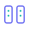

<div align="right">
  <a href="README.md">English</a> | <strong>简体中文</strong> | <a href="README.ja.md">日本語</a>
</div>

<div align="center">
  <a href="https://nebutra.com">
    <picture>
      <source media="(prefers-color-scheme: dark)" srcset="packages/design/brand/assets/logo/logo-inverse.svg" />
      <source media="(prefers-color-scheme: light)" srcset="packages/design/brand/assets/logo/logo-horizontal-zh.svg" />
      
    </picture>
  </a>
  <br />
  <br />
  <h3>开源的 AI 原生 SaaS 平台基线</h3>
  <p><em>面向 AI 网关、计费、认证、合规与白标交付的可治理多租户产品基础设施。</em></p>
  <br />
  <p>
    <a href="https://nebutra.com"><strong>官网</strong></a> · 
    <a href="#-简介"><strong>简介</strong></a> · 
    <a href="#%EF%B8%8F-技术栈"><strong>技术栈</strong></a> · 
    <a href="#-快速开始"><strong>快速开始</strong></a> · 
    <a href="#-参与贡献"><strong>贡献</strong></a>
  </p>
  <br />
  <p>
    <a href="https://github.com/{{repo.full}}/stargazers">
      
    </a>
    <a href="https://github.com/{{repo.full}}/network/members">
      
    </a>
    <a href="https://github.com/{{repo.full}}/blob/main/LICENSE">
      
    </a>
    <a href="#许可证">
      
    </a>
  </p>
  <p>
    <a href="https://securityscorecards.dev/viewer/?uri=github.com/{{repo.full}}">
      
    </a>
    <a href="https://socket.dev/npm/package/nebutra">
      
    </a>
    <a href="https://www.npmjs.com/package/nebutra">
      
    </a>
    <a href="https://www.npmjs.com/package/create-sailor">
      
    </a>
  </p>
  <p>
    <a href="https://x.com/nebutra">
      
    </a>
  </p>
  <p>
    <a href="https://discord.gg/nebutra">
      
    </a>
  </p>
</div>

<br />
<br />

> **License 一览** —— npm 上发布的包都是 **MIT**。直接 fork 源码仓库仍然是
> **AGPL-3.0-only**，除非你 (a) 用 `npx create-sailor` 脚手架（独立开发者
> 授权，≤ 1 FTE 且 < $1M ARR 免费，**无 Copyleft**），或者 (b) 持有
> [LICENSE-COMMERCIAL.md](./LICENSE-COMMERCIAL.md) 里的 Startup
> ($799/年) 或 Enterprise 商业授权。完整边界和边缘情况参见下方
> [License](#license) 章节和
> [docs/legal/licensing-faq.md](docs/legal/licensing-faq.md)。

> **30 秒上手** —— 零 SaaS 密钥即可启动:
> ```bash
> npx create-sailor@latest my-app --preset=minimal --yes
> cd my-app && pnpm dev   # → http://localhost:3000
> ```
> `minimal` 预设只生成 `apps/web` + IAM + 本地 Postgres，让黄金路径
> 能在本地 DB 上跑起来。之后再用 `nebutra add <provider>` 接入
> Stripe / Clerk / Resend 等。

<br />

## 简介

{{brand.name}} Sailor 是一个企业级、AI 原生的 SaaS 单体仓库架构，专为构建可治理的现代多租户平台而设计。它为 AI 网关、智能体工作流、计费、认证、合规和白标产品交付提供可落地的平台基线。

采用 Next.js 16、React 19、Prisma 7 和 Vercel AI SDK 构建，Sailor 把 AI 当作需要治理的运行时能力：供应商拓扑、模型路由、可观测性、租户隔离和合规钩子都属于平台基线。

### 谁在构建这个项目

{{repo.name}} 由 **{{company.nameCN}}**（{{company.name}}）维护。日常工程负责人是 **Tseka Luk**（[@tsekaluk](https://github.com/tsekaluk) · `legal@nebutra.com`）。项目采用双授权（dual-license）模型，让独立开发者和 OPC 可以在不被 Copyleft 限制的情况下构建商业产品，同时确保企业 fork 仍需回馈社区——详见下方 [License](#license) 章节。

我们以 `@nebutra/*` 这个 npm scope 发布所有包，外加两个 CLI（`nebutra` 和 `create-sailor`）。发布流程通过 [changesets](https://github.com/changesets/changesets) 驱动，并以手动 `workflow_dispatch` 作为发版门槛；每次发布会生成 SBOM 验证（见 [release.yml](.github/workflows/release.yml)）。安全报告请走 [SECURITY.md](SECURITY.md)；商务/授权咨询请发 `legal@nebutra.com`。

### 品牌愿景

Nebula • Nurture • Ultra • Future

- Nebula（云端聚合）：整合数据与工具，沉淀为可用产品与服务。
- Nurture（孕育智能）：借助自动化工具链与“数字员工”，持续孵化 AI 应用。
- Ultra（臻于至善）：以工程可靠与价值交付为核心。
- Future（引领未来）：让 AI 生产力普惠每个人。

### 关于公司

<div align="center">
  <h4>{{brand.name}} Intelligence</h4>
  <sub>{{company.nameCN}}</sub>
  <br /><br />
  <p>
    AI 原生基础设施公司，构建可治理的产品平台基线<br />
    覆盖多租户 SaaS、智能体工作流、发布运营与全球化交付
  </p>
  <p align="center">真正长期的护城河不是一个模板，而是把持续变化的 AI 能力转化成可治理、可交付系统的能力。</p>
</div>

> AI 可以帮助做出演示，Sailor 聚焦更难的生产层：治理、安全、架构、可扩展性和收入运营。
>
> 目标不是在向导里逐个选择供应商，而是运营一个能跨供应商、区域、租户和合规边界演进的 AI 拓扑。

<br />

<div align="center">
<table>
<tr>
<td align="center" width="25%">
  <h3>🚀</h3>
  <strong>软件出海</strong><br />
  <sub>Day 1 面向全球市场</sub>
</td>
<td align="center" width="25%">
  <h3>🤖</h3>
  <strong>AI 原生架构</strong><br />
  <sub>LLM · Multi-Agent · MCP</sub>
</td>
<td align="center" width="25%">
  <h3>💼</h3>
  <strong>平台治理</strong><br />
  <sub>拓扑 · 契约 · CI</sub>
</td>
<td align="center" width="25%">
  <h3>🦄</h3>
  <strong>发布基础设施</strong><br />
  <sub>认证 · 计费 · AI 网关</sub>
</td>
</tr>
</table>
</div>

#### 愿景宣言（Manifesto）

- 在加速度时代，技术壁垒难以恒久。真正的壁垒，是持续创新的想象力、对趋势的洞察力、对错误的敏捷纠错力，以及把想法更快落地的执行力。
- 保守决策看似稳妥，实则更激进：不改变，就是押注世界不变；而世界唯一不变的，是变化。

### 为什么选择 Sailor？

**面向可治理的 AI 原生产品**：Sailor 填补了「AI 帮我做出演示」和「这是一个可以运营、审计、计费和扩展的平台」之间的鸿沟。

<table>
<tr>
<td width="50%">

|     | 特性           | 说明                            |
| :-: | :------------- | :------------------------------ |
| 🚀  | **生产就绪**   | 企业部署验证的架构模式          |
| 🤖  | **AI 原生**    | LLM・Embeddings・RAG・MCP Agent |
| 🏢  | **多租户**     | RLS・租户隔离・租户定制         |
| ⚡  | **现代技术栈** | Next.js 16・React 19・TypeScript 5.9 |
| 💳  | **计费内置**   | Stripe・用量计量・功能权限      |

</td>
<td width="50%">

|     | 特性               | 说明                            |
| :-: | :----------------- | :------------------------------ |
| 📋  | **合规基础设施**   | GDPR/CCPA・Cookie 同意          |
| 🔐  | **安全优先**       | WAF・RLS・提示注入控制          |
| 🌍  | **全球化**         | i18n・CDN・边缘缓存             |
| 👤  | **运营就绪**       | 多智能体・自动化 CI/CD          |
| 🚢  | **发布就绪**       | 演示 → 产品 → 收入              |

</td>
</tr>
</table>

## 亮点

<table>
  <tr>
    <td width="33%" valign="top">
      <br />
      <strong>AI 原生</strong>
      <br />内置 LLM、向量检索、MCP Agents，以及高级的 Lobe UI 聊天体验。
    </td>
    <td width="33%" valign="top">
      <br />
      <strong>多租户为先</strong>
      <br />租户上下文、RLS、缓存与限流按租户隔离。
    </td>
    <td width="33%" valign="top">
      <br />
      <strong>企业级工程</strong>
      <br />Cloudflare WAF/R2、Inngest 工作流、Sentry/Otel、Vercel 部署。
    </td>
  </tr>
  <tr>
    <td width="33%" valign="top">
      <br />
      <strong>计费与变现</strong>
      <br />数据库驱动计划、Stripe 计费、用量计量、功能门控。
    </td>
    <td width="33%" valign="top">
      <br />
      <strong>安全与合规</strong>
      <br />RLS、WAF、Turnstile、GDPR/CCPA、Cookie 同意。
    </td>
    <td width="33%" valign="top">
      <br />
      <strong>营销 UI 套件</strong>
      <br />Hero、Features、Pricing、Testimonials 等转化优化组件。
    </td>
  </tr>
  <tr>
    <td width="33%" valign="top">
      <br />
      <strong>自动化架构治理</strong>
      <br />内置 <code>vitest.arch</code> 边界测试与严格的语义化 Token 校验。
    </td>
    <td width="33%" valign="top">
      <br />
      <strong>零运行时 CSS</strong>
      <br />纯 CSS 变量作为 SSOT，彻底抛弃 CSS-in-JS 性能损耗。
    </td>
    <td width="33%" valign="top">
      <br />
      <strong>按需模块化 DX</strong>
      <br />配置文件隔离，本地开发仅需按需启动核心微服务。
    </td>
  </tr>
  <tr>
    <td width="33%" valign="top">
      <br />
      <strong>自带商业化 MCP 网关</strong>
      <br />基于订阅计划的 Model Context Protocol 访问控制与审计额度。
    </td>
    <td width="33%" valign="top">
      <br />
      <strong>分布式 Saga 编排器</strong>
      <br />纯 TypeScript 编排机制，自带事务失败自动回滚与补偿。
    </td>
    <td width="33%" valign="top">
      <br />
      <strong>多租户事件总线隔离</strong>
      <br />强制 <code>tenantId</code> 隔离，原生支持异步广播与同步等待流。
    </td>
  </tr>
  <tr>
    <td width="33%" valign="top">
      <br />
      <strong>多端监控集成网关</strong>
      <br />单节点并发检测 9 个微服务及组件，提供 OpenStatus 与 Atlassian Statuspage 的标准化遥测。
    </td>
    <td width="33%" valign="top"></td>
    <td width="33%" valign="top"></td>
  </tr>
</table>

<br />

## 技术栈

<table>
<tr>
<td><strong>前端</strong></td>
<td>
  <a href="https://nextjs.org/"></a>
  <a href="https://react.dev/"></a>
  <a href="https://www.typescriptlang.org/"></a>
  <a href="https://tailwindcss.com/"></a>
  <a href="https://storybook.js.org/"></a>
</td>
</tr>
<tr>
<td><strong>UI / 设计</strong></td>
<td>
  <a href="https://www.radix-ui.com/"></a>
  
  
  
  
  
  
</td>
</tr>
<tr>
<td><strong>认证</strong></td>
<td>
  <a href="https://clerk.com/"></a>
  <a href="https://www.better-auth.com/"></a>
  <a href="https://authjs.dev/"></a>
  
  
</td>
</tr>
<tr>
<td><strong>BFF 层</strong></td>
<td>
  <a href="https://hono.dev/"></a>
  <a href="https://www.prisma.io/"></a>
  <a href="https://zod.dev/"></a>
</td>
</tr>
<tr>
<td><strong>后端 (Python)</strong></td>
<td>
  <a href="https://fastapi.tiangolo.com/"></a>
  <a href="https://www.uvicorn.org/"></a>
  <a href="https://docs.pydantic.dev/"></a>
  
</td>
</tr>
<tr>
<td><strong>数据库</strong></td>
<td>
  <a href="https://supabase.com/"></a>
  
  
  <a href="https://clickhouse.com/"></a>
  
  
</td>
</tr>
<tr>
<td><strong>缓存 / 限流</strong></td>
<td>
  <a href="https://upstash.com/"></a>
  
  
</td>
</tr>
<tr>
<td><strong>实时通信</strong></td>
<td>
  <a href="https://pusher.com/"></a>
  <a href="https://soketi.app/"></a>
  
</td>
</tr>
<tr>
<td><strong>AI</strong></td>
<td>
  <a href="https://sdk.vercel.ai/"></a>
  <a href="https://vercel.com/ai-gateway"></a>
  <a href="https://openrouter.ai/"></a>
  
  
  
  
  
  
  
</td>
</tr>
<tr>
<td><strong>搜索</strong></td>
<td>
  <a href="https://www.meilisearch.com/"></a>
  <a href="https://typesense.org/"></a>
  <a href="https://www.algolia.com/"></a>
</td>
</tr>
<tr>
<td><strong>队列</strong></td>
<td>
  <a href="https://upstash.com/qstash"></a>
  <a href="https://docs.bullmq.io/"></a>
</td>
</tr>
<tr>
<td><strong>存储 / 上传</strong></td>
<td>
  <a href="https://www.cloudflare.com/products/r2/"></a>
  <a href="https://aws.amazon.com/s3/"></a>
  <a href="https://vercel.com/docs/storage/vercel-blob"></a>
  
  
</td>
</tr>
<tr>
<td><strong>通知</strong></td>
<td>
  <a href="https://novu.co/"></a>
  
  
  
  
</td>
</tr>
<tr>
<td><strong>Webhook</strong></td>
<td>
  <a href="https://www.svix.com/"></a>
  
  
</td>
</tr>
<tr>
<td><strong>短信 (国内)</strong></td>
<td>
  
  
</td>
</tr>
<tr>
<td><strong>支付</strong></td>
<td>
  <a href="https://stripe.com/"></a>
  
  
</td>
</tr>
<tr>
<td><strong>邮件</strong></td>
<td>
  <a href="https://resend.com/"></a>
  <a href="https://react.email/"></a>
</td>
</tr>
<tr>
<td><strong>CMS / 文档</strong></td>
<td>
  <a href="https://www.sanity.io/"></a>
  <a href="https://fumadocs.vercel.app/"></a>
  <a href="https://mintlify.com/"></a>
</td>
</tr>
<tr>
<td><strong>设计同步</strong></td>
<td>
  <a href="https://figma.com/"></a>
  <a href="https://penpot.app/"></a>
</td>
</tr>
<tr>
<td><strong>CDN / 安全</strong></td>
<td>
  <a href="https://cloudflare.com/"></a>
  
  
  
  
</td>
</tr>
<tr>
<td><strong>工作流</strong></td>
<td>
  <a href="https://www.inngest.com/"></a>
  <a href="https://n8n.io/"></a>
  
</td>
</tr>
<tr>
<td><strong>分析</strong></td>
<td>
  <a href="https://dub.co/"></a>
  
  
</td>
</tr>
<tr>
<td><strong>可观测性</strong></td>
<td>
  <a href="https://sentry.io/"></a>
  <a href="https://opentelemetry.io/"></a>
  <a href="https://www.openstatus.dev/"></a>
</td>
</tr>
<tr>
<td><strong>构建 / 部署</strong></td>
<td>
  <a href="https://vercel.com/"></a>
  <a href="https://turbo.build/"></a>
  <a href="https://pnpm.io/"></a>
  <a href="https://biomejs.dev/"></a>
</td>
</tr>
</table>

<br />

## 平台能力

Sailor 是**与 Provider 无关**的：以下每个平台包都会从环境变量自动检测后端实现，客户切换 provider 无需改动应用代码。每个包都内置 in-memory 实现用于测试，并通过 [tests/architecture/](tests/architecture/) 下的架构测试强制约束 TypeScript 契约。

<table>
<tr><th>能力</th><th>包</th><th>支持的 Provider（自动检测）</th></tr>
<tr><td>身份认证</td><td><code>@nebutra/auth</code></td><td>Clerk · Better Auth · Auth.js</td></tr>
<tr><td>身份提供方</td><td><code>@nebutra/oauth-server</code></td><td>OIDC (oidc-provider) · Redis 会话</td></tr>
<tr><td>权限</td><td><code>@nebutra/permissions</code></td><td>CASL — RBAC + ABAC，Hono 中间件，React <code>&lt;Can /&gt;</code></td></tr>
<tr><td>多租户</td><td><code>@nebutra/tenant</code></td><td>AsyncLocalStorage 上下文 · Prisma RLS 桥接</td></tr>
<tr><td>验证码</td><td><code>@nebutra/captcha</code></td><td>Cloudflare Turnstile</td></tr>
<tr><td>密钥保险库</td><td><code>@nebutra/vault</code></td><td>AWS KMS 信封加密 · 本地 HKDF（开发）</td></tr>
<tr><td>审计日志</td><td><code>@nebutra/audit</code></td><td>追加式哈希链</td></tr>
<tr><td>缓存</td><td><code>@nebutra/cache</code></td><td>Upstash Redis · in-memory</td></tr>
<tr><td>限流</td><td><code>@nebutra/rate-limit</code></td><td>滑动窗口 · 令牌桶（Upstash）</td></tr>
<tr><td>队列</td><td><code>@nebutra/queue</code></td><td>QStash · BullMQ · in-memory</td></tr>
<tr><td>搜索</td><td><code>@nebutra/search</code></td><td>Meilisearch · Typesense · Algolia</td></tr>
<tr><td>存储 / 上传</td><td><code>@nebutra/uploads</code></td><td>Cloudflare R2 · AWS S3 · Vercel Blob · 本地文件系统</td></tr>
<tr><td>通知</td><td><code>@nebutra/notifications</code></td><td>Novu — 应用内 · 邮件 · 推送 · 短信 · 即时聊天</td></tr>
<tr><td>Webhook</td><td><code>@nebutra/webhooks</code></td><td>Svix · 自定义 HMAC 投递</td></tr>
<tr><td>短信（国内）</td><td><code>@nebutra/sms</code></td><td>阿里云 · 腾讯云</td></tr>
<tr><td>邮件</td><td><code>@nebutra/email</code></td><td>Resend + React Email 模板</td></tr>
<tr><td>计费</td><td><code>@nebutra/billing</code></td><td>Stripe — 订阅、用量、权益</td></tr>
<tr><td>用量计量</td><td><code>@nebutra/metering</code></td><td>ClickHouse 实时聚合</td></tr>
<tr><td>事件总线</td><td><code>@nebutra/event-bus</code></td><td>多租户 Pub/Sub · Fan-out · Request-Reply</td></tr>
<tr><td>Saga 编排</td><td><code>@nebutra/saga</code></td><td>原生 TS 流程，自动回滚补偿</td></tr>
<tr><td>特性开关</td><td><code>@nebutra/feature-flags</code></td><td>数据库存储 + 环境变量覆盖</td></tr>
<tr><td>设计令牌</td><td><code>@nebutra/design-sync</code></td><td>W3C DTCG ↔ Figma · Penpot · git-only</td></tr>
<tr><td>状态聚合</td><td><code>@nebutra/status</code></td><td>OpenStatus · Atlassian StatusPage</td></tr>
</table>

<br />

## 项目结构

```
{{repo.name}}/
├── apps/                      # 用户面应用 (Next.js)
│   ├── landing-page/      # 营销官网 (nebutra.com)
│   ├── web/               # SaaS 主控台 (app.nebutra.com)
│   ├── studio/            # Sanity CMS (studio.nebutra.com)
│   ├── design-docs/       # 组件文档站 (Fumadocs)
│   ├── sailor-docs/       # 公开产品文档 (docs.nebutra.com)
│   ├── idp/               # 身份认证服务 (OAuth 2.0 / OIDC)
│   ├── storybook/         # 组件 Playground
│   ├── mail-preview/      # 邮件模板预览
│   ├── sleptons/          # Sleptons 配套应用
│   └── tsekaluk-dev/      # 作者开发场地
├── packages/                  # 共享 TS 库（W3b 已分类）
│   ├── ai/                # 3 个 — agents、ai-providers、mcp
│   ├── commerce/          # 7 个 — billing、contracts、marketing、metering、license、legal、waitlist
│   ├── design/            # 7 个 — ui、tokens、brand、theme、icons、design-tokens、design-sync
│   ├── iam/               # 8 个 — auth、audit、vault、oauth-server、permissions、tenant、identity、captcha
│   ├── integrations/      # 11 个 — queue、search、email、notifications、storage、webhooks、cache、sms、uploads、event-bus、saga
│   ├── ops/               # 6 个 — cli、create-sailor、preset、sanity、supabase、china-compliance
│   └── platform/          # 13 个 — db、logger、rate-limit、feature-flags、gateway-core、errors、config、health、status、alerting、analytics、repositories、i18n
├── backends/                  # 无 UI 后端（按语言拆分，参考 vercel/vercel）
│   ├── gateway/           # TypeScript / Hono — BFF、auth、租户、路由
│   └── python/            # FastAPI — 仅当 ML/批处理/专用库无法用 TS 时启用
│       ├── _shared/       # 跨服务原语（auth、db、queue 客户端）
│       └── ai/            # LLM、Embeddings、Agent 编排
├── infra/                     # 基础设施（W2.2 按职责拆分）
│   ├── iac/               # terraform + k8s + ecs + cloudflare + railway
│   ├── runtime/           # nginx + docker + analytics + compose 文件
│   ├── data/              # database (RLS) + clickhouse (init + dbt)
│   └── ops/               # observability + 部署脚本
├── workflows/                 # 事件驱动业务流（W2.3 抽离）
│   ├── inngest/           # Serverless 后台任务 + 定时
│   ├── n8n/               # 可视化工作流自动化
│   └── pusher/            # 实时消息粘合层
├── e2e/                       # Playwright E2E 测试 (smoke / golden / sleptons)
├── tests/                     # 架构不变量 + 压测 + UI 治理
└── docs/                      # 架构文档
```

<br />

## 文档

各组件均有独立 README，包含配置说明和 API 文档：

<table>
<tr>
<td><strong>微服务</strong></td>
<td>
  <a href="backends/python/ai/">AI</a>
</td>
</tr>
<tr>
<td><strong>公共包</strong></td>
<td>
  <a href="packages/design/ui/">UI</a> ·
  <a href="packages/design/tokens/">Tokens</a> ·
  <a href="packages/commerce/marketing/">Marketing</a> · 
  <a href="packages/platform/db/">DB</a> ·
  <a href="packages/integrations/cache/">Cache</a> · 
  <a href="packages/platform/rate-limit/">Rate Limit</a> · 
  <a href="packages/integrations/event-bus/">Event Bus</a> · 
  <a href="packages/integrations/saga/">Saga</a> · 
  <a href="packages/ai/mcp/">MCP</a> · 
  <a href="packages/platform/analytics/">Analytics</a>
</td>
</tr>
<tr>
<td><strong>设计文档</strong></td>
<td>
  <a href="apps/design-docs/">设计系统文档站</a> (Fumadocs)
</td>
</tr>
<tr>
<td><strong>基础设施</strong></td>
<td>
  <a href="infra/runtime/docker/">Docker</a> · 
  <a href="infra/iac/k8s/">Kubernetes</a> · 
  <a href="infra/iac/terraform/">Terraform</a> · 
  <a href="workflows/inngest/">Inngest</a> · 
  <a href="workflows/n8n/">n8n</a> · 
  <a href="workflows/pusher/">Pusher</a> · 
  <a href="infra/ops/observability/">可观测性</a>
</td>
</tr>
</table>

<br />

## CLI 与官网

### 通过 npm 使用 CLI

新项目建议直接从 npm 创建，不需要先 clone 整个 monorepo 再裁剪：

```bash
# 创建新的 Sailor 项目
npx create-sailor@latest
npm create sailor@latest
pnpm create sailor@latest
bunx create-sailor@latest

# 运维已有的 Sailor 项目
npx nebutra --help
npm install -g nebutra
```

| 包 | 用途 |
| -- | ---- |
| [`create-sailor`](https://www.npmjs.com/package/create-sailor) | 创建新的 {{brand.name}} Sailor 项目，内置区域化默认值和拓扑优先的 AI 网关配置。 |
| [`nebutra`](https://www.npmjs.com/package/nebutra) | 治理已有项目：功能注册表安装、AI 供应商治理、网关路由、Schema 和诊断。 |

### nebutra.com

[`nebutra.com`](https://nebutra.com) 是 {{brand.name}} Sailor 的公开产品入口，也是我们自己 dogfooding 这套平台的地方。后续更多产品能力、商业授权、托管能力、发布工作流和基于本仓库构建的真实案例都会在官网持续更新。

<br />

## 快速开始

### 环境要求

<table>
<tr><td><strong>Node.js</strong></td><td><code>v22+</code></td></tr>
<tr><td><strong>pnpm</strong></td><td><code>v10.32+</code></td></tr>
<tr><td><strong>Python</strong></td><td><code>3.11+</code> <sub>（微服务需要）</sub></td></tr>
</table>

### 安装

```bash
# 克隆仓库
git clone https://github.com/{{repo.full}}.git
cd {{repo.name}}

# 安装依赖
pnpm install

# 配置环境变量
cp .env.example .env

# 生成 Prisma 客户端并启动开发服务器
pnpm db:generate && pnpm dev
```

### 常用命令

| 命令               | 说明                           |
| ------------------ | ------------------------------ |
| `pnpm dev`         | 启动所有应用（开发模式）       |
| `pnpm build`       | 构建所有包（自动同步品牌资产） |
| `pnpm lint`        | 代码检查                       |
| `pnpm typecheck`   | 类型检查                       |
| `pnpm db:studio`   | 打开 Prisma Studio             |
| `pnpm brand:sync`  | 同步品牌资产到各应用           |
| `pnpm brand:init`  | 初始化白标品牌                 |
| `pnpm brand:apply` | 应用自定义品牌                 |

<br />

## 白标定制

Fork 本仓库并自定义为你的品牌：

```bash
# 交互式设置向导
pnpm brand:init

# 将 logo 放入 brand.config/assets/

# 应用品牌
pnpm brand:apply
```

详见 [WHITELABEL.md](WHITELABEL.md)。

<br />

## 参与贡献

我们欢迎所有贡献者！以下是参与方式：

|              |                                                                |
| ------------ | -------------------------------------------------------------- |
| **报告 Bug** | [提交 Issue](https://github.com/{{repo.full}}/issues) |
| **功能建议** | 通过 Issue 提出                                                |
| **提交 PR**  | 添加功能或修复 Bug                                             |

### 开发流程

```
1. Fork 本仓库
2. 创建功能分支 (git checkout -b feat/amazing-feature)
3. 提交更改 (git commit -m 'feat: 添加精彩功能')
4. 推送分支 (git push origin feat/amazing-feature)
5. 发起 Pull Request
```

<br />

## 版本与发布节奏

所有已发布的包目前都在 **0.x 版本区间**，公共 API 仍在收敛。按
[SemVer §4](https://semver.org/lang/zh-CN/#spec-item-4)，主版本号为零意味着
**任何 0.x 发布都可能包含破坏性变更**——在生产环境请精确锁定版本
(`"nebutra": "0.3.1"`)，不要用 caret 范围，等我们切到 1.0 之后再放开。

- 版本由 [changesets](https://github.com/changesets/changesets) 驱动。每个改动已发布包的 PR 都必须包含 `.changeset/*.md` 声明 patch/minor/major 意图——CI 会强制这个 gate。
- 每个包的 `CHANGELOG.md` 由 `changeset version` 生成并与版本号一同提交（例如 [`packages/ops/cli/CHANGELOG.md`](packages/ops/cli/CHANGELOG.md)）。
- Release 工作流是**手动触发**（`workflow_dispatch`）——不会在 PR 合并后突然发版。我们会成批协调相关改动后才切版本。
- 1.0 之前的重大 API 改动（例如 CLI 命令重命名、包的目录重新分类）会先发 **release candidate**：`nebutra@0.4.0-rc.0` 落在 `next` dist-tag，浸泡 ≥ 1 周后才升为 `latest`。安装 RC：`npm i nebutra@next`。
- npm 发布会附带 **provenance attestation**（一旦 npm registry 端启用了 trusted-publishing；工作流端已经接好——见 [`release.yml`](.github/workflows/release.yml) 的 `NPM_CONFIG_PROVENANCE: "true"`）。验证已发布的 tarball：`npm view <pkg> --json | jq .dist.attestations`。

我们会以发布 `1.0.0` 来标志 **API 稳定**。在那之前，请把当前的 API 理解为
"形态可生产，细节仍在演进"。

<br />

## 许可证

{{repo.name}} 采用双许可证模型：npm 发布包走 **MIT**，直接 fork 本仓库仍走
**AGPLv3**。

|                |                                    |
| -------------- | ---------------------------------- |
| **npm 安装包** | MIT，无 Copyleft                   |
| **直接 fork**  | AGPLv3，网络使用需开源             |
| **免费使用**   | 个人项目、学习和内部工具           |
| **可自由修改** | 创建衍生作品                       |
| **可自由分发** | 需注明出处                         |
| **豁免**       | {{company.nameCN}}及关联组织 |

如需商业授权，请与我们联系。

<br />

---

<br />

<div align="center">
  <a href="https://nebutra.com">
    <picture>
      <source media="(prefers-color-scheme: dark)" srcset="packages/design/brand/assets/logo/logo-inverse.svg" width="120">
      <source media="(prefers-color-scheme: light)" srcset="packages/design/brand/assets/logo/logo-mono.svg" width="120">
      
    </picture>
  </a>
  <br />
  <br />
  <p>
<strong>每一次上线，都是增长在场。</strong>
  </p>
  <p>
    <sub>出品 <a href="https://nebutra.com"><strong>{{brand.name}} Intelligence</strong></a> · © 2024-至今 <strong>{{company.nameCN}}</strong></sub>
  </p>
  <br />
  <p>
    <a href="https://nebutra.com">官网</a>
  </p>
  <p>
    <a href="https://x.com/nebutra">X</a>
  </p>
  <p>
    <a href="https://discord.gg/nebutra">Discord</a>
  </p>
  <p>
    <a href="mailto:contact@nebutra.com">联系我们</a>
  </p>
</div>
