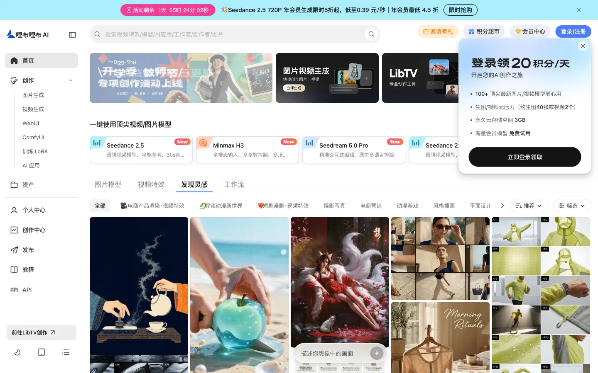
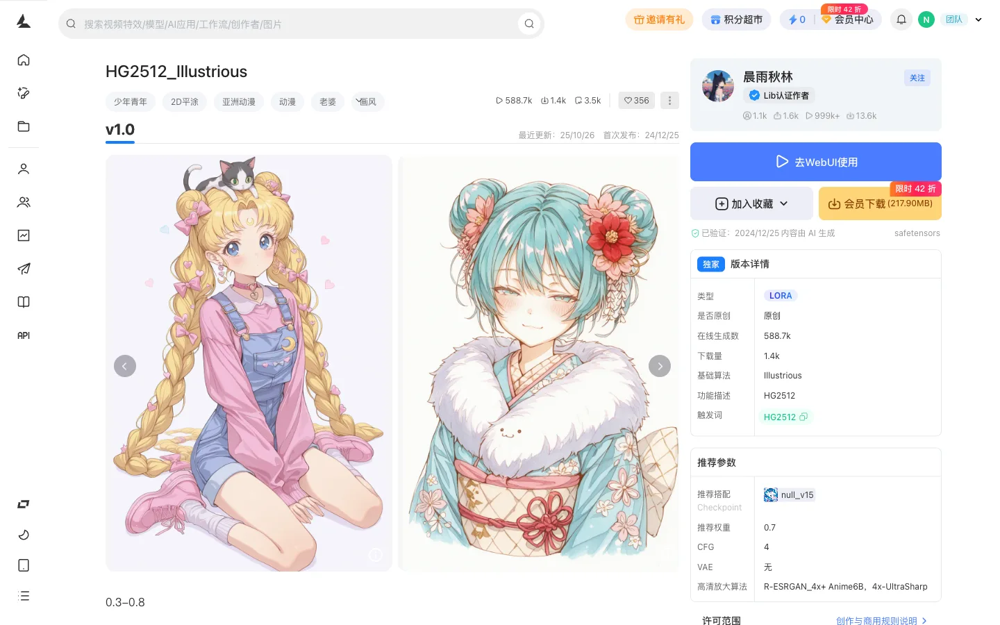
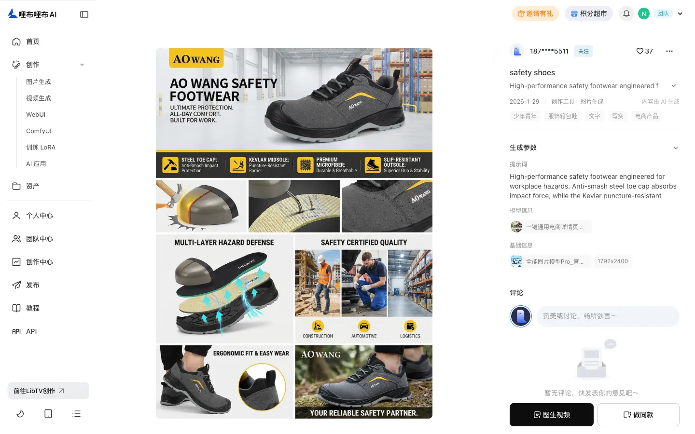
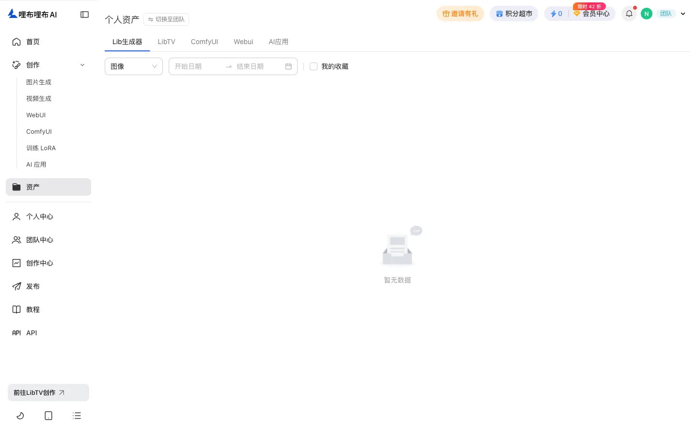
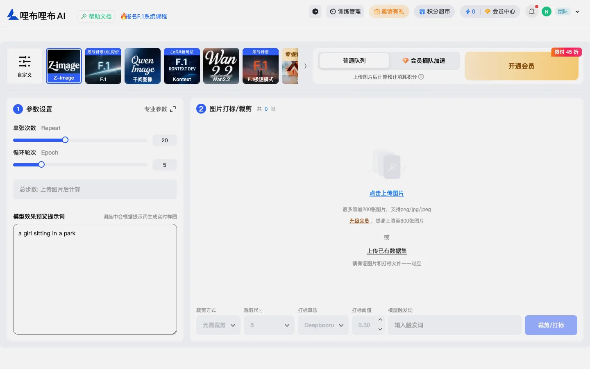
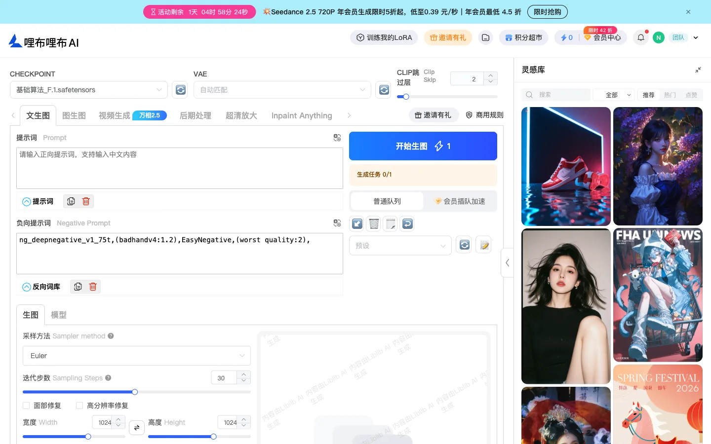
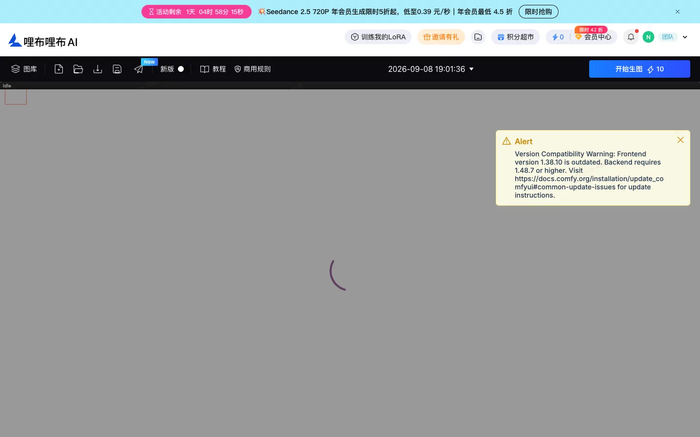
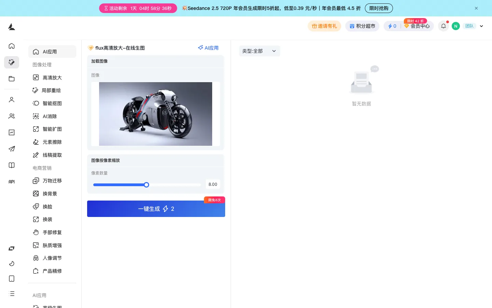

# libtv.art-community — summary

States: 8 · Transitions: 10 · Explored 2026-09-08 (owner session via opencli bridge; credits 0, no generation submitted).

## States

- `libtv.art-community.home-feed` — tab 图片模型 · overlay login-promo · selected none — 
- `libtv.art-community.model-detail` — tab v1.0 · overlay none · selected model:HG2512_Illustrious (LoRA) — 
- `libtv.art-community.image-detail` — tab none · overlay none · selected image:18fc4df8 — 
- `libtv.art-community.asset` — tab 个人资产 · overlay none · selected none — 
- `libtv.art-community.pretrain` — tab none · overlay none · selected none — 
- `libtv.art-community.sd-webui` — tab 文生图 · overlay none · selected none — 
- `libtv.art-community.comfy` — tab none · overlay none · selected none — 
- `libtv.art-community.lib3-app` — tab none · overlay none · selected app:flux高清放大 — 

## Key observations

- **O** (libtv.art-community.home-feed) Feed cards are typed (Checkpoint / LORA / 模板) and link to model or image detail.
- **O** (libtv.art-community.model-detail) LoRA is consumed in WebUI; recommended params are documentation, not a one-click preset into the consumer generator.
- **O** (libtv.art-community.image-detail) 做同款 opens the generator prefilled from the post (window.open with fillimgid).
- **O** (libtv.art-community.asset) Flat asset list; no project container.
- **O** (libtv.art-community.pretrain) LoRA is the user-trainable identity on liblib.art; outputs land in 训练管理.
- **O** (libtv.art-community.sd-webui) Full A1111-style parameter surface; this is the 'advanced-only' tier of the LibLib ecosystem.
- **O** (libtv.art-community.comfy) Hosted ComfyUI; not explored further (workflow editor).
- **O** (libtv.art-community.lib3-app) AI 应用 = packaged ComfyUI workflow with a minimal form.

## Transitions

- libtv.art-community.home-feed —[click: 前往LibTV创作]→ libtv.tv-home.default · url.changed (origin liblib.tv) (O)
- libtv.art-community.home-feed —[click: model card]→ libtv.art-community.model-detail · url.changed (O)
- libtv.art-community.home-feed —[click: image card]→ libtv.art-community.image-detail · url.changed (O)
- libtv.art-community.image-detail —[click: 做同款]→ libtv.art-generator.image-default · window.open /ai-tool/image-generator?fillimgid=… (O)
- libtv.art-community.model-detail —[click: 去WebUI使用]→ libtv.art-community.sd-webui · expected route /sd (click produced no navigation in bridge) (I2)
- libtv.art-community.home-feed —[navigate: 创作 ▾ → 训练 LoRA]→ libtv.art-community.pretrain · url.changed (O)
- libtv.art-community.home-feed —[navigate: 创作 ▾ → WebUI]→ libtv.art-community.sd-webui · url.changed (O)
- libtv.art-community.home-feed —[navigate: 创作 ▾ → ComfyUI]→ libtv.art-community.comfy · url.changed (O)
- libtv.art-community.home-feed —[navigate: 创作 ▾ → AI 应用]→ libtv.art-community.lib3-app · url.changed (O)
- libtv.art-community.home-feed —[navigate: 资产]→ libtv.art-community.asset · url.changed (O)
