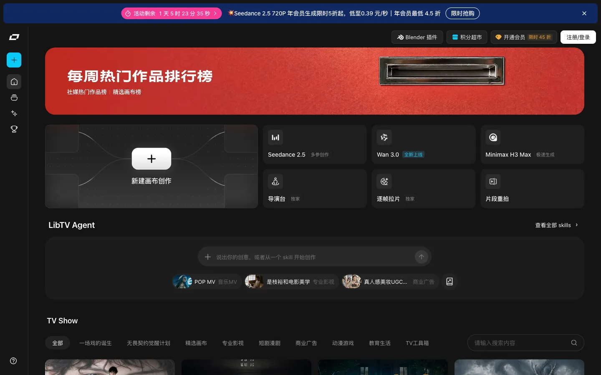
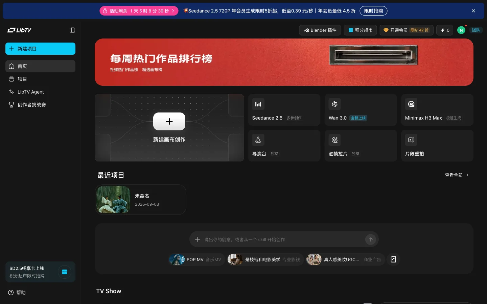
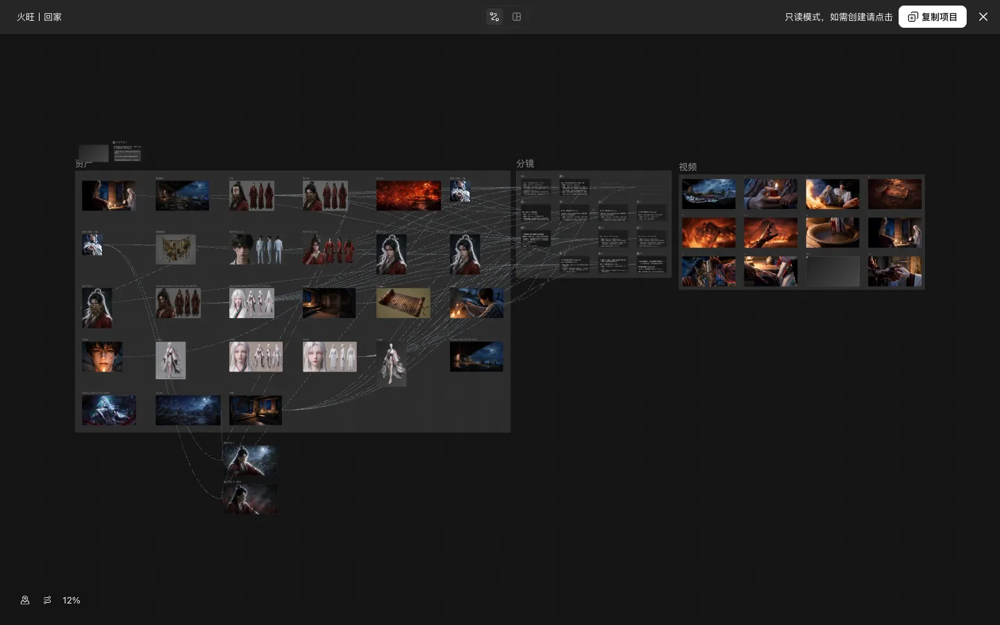
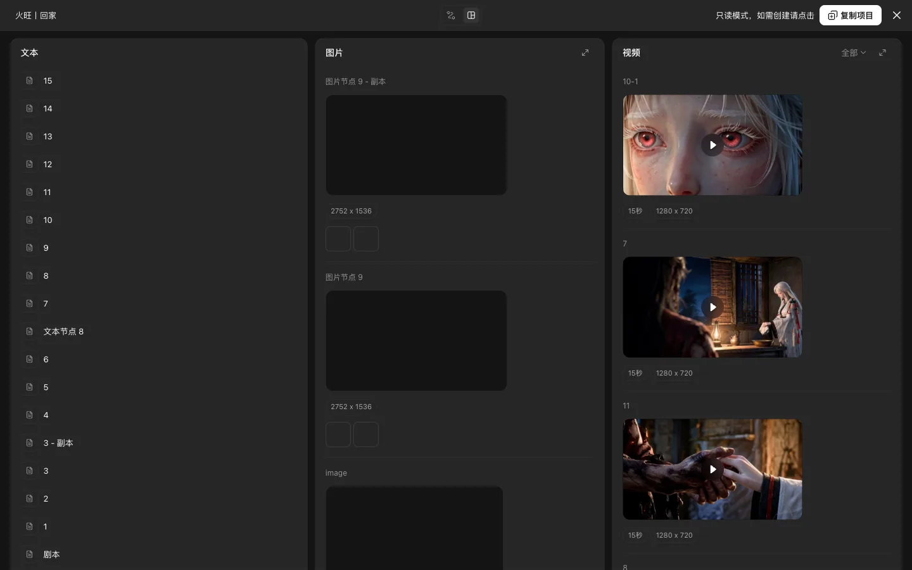

# libtv.tv-home — summary

States: 4 · Transitions: 9 · Explored 2026-09-08 (owner session via opencli bridge; credits 0, no generation submitted).

## States

- `libtv.tv-home.default` — tab TV Show:全部 · overlay none · selected none — 
- `libtv.tv-home.logged-in` — tab TV Show:全部 · overlay none · selected none — 
- `libtv.tv-home.creation-process-viewer` — tab 工作流 · overlay creation-process-viewer · selected project:火旺丨回家 — 
- `libtv.tv-home.creation-process-viewer.storyboard` — tab 故事板 · overlay creation-process-viewer · selected project:火旺丨回家 — 

## Key observations

- **O** (libtv.tv-home.default) Landing surface of the professional tool; all launchers resolve to /canvas.
- **O** (libtv.tv-home.default) Promo banner with countdown is persistent chrome.
- **O** (libtv.tv-home.logged-in) Recent projects surface on home after hydration; no dedicated projects route observed.
- **O** (libtv.tv-home.creation-process-viewer) URL does not change; <title> changes to the project name. Graph shows ~40 asset image nodes, a 分镜 text-card group and a 视频 group linked by edges.
- **O** (libtv.tv-home.creation-process-viewer) Banner: 只读模式，如需创建请点击 复制项目.
- **O** (libtv.tv-home.creation-process-viewer.storyboard) 故事板 is a projection of the same nodes grouped by type; storyboard text nodes render markdown-like h3 sections.

## Transitions

- libtv.tv-home.default —[navigate: hydration / cross-storage auth]→ libtv.tv-home.logged-in · header shows avatar (O)
- libtv.tv-home.logged-in —[click: 新建项目]→ libtv.canvas.default · project.created, url.changed, agent-drawer.opened (O)
- libtv.tv-home.default —[click: 新建画布创作]→ libtv.canvas.default · window.open /canvas?newProject=true&createWorkspace=true (O)
- libtv.tv-home.default —[click: 导演台 / 逐帧拉片 / 片段重拍 / model cards]→ libtv.canvas.template-virtual-studio · window.open /canvas?sourceSpaceId&sourceProjectUuid, project.cloned (O)
- libtv.tv-home.default —[click: 逐帧拉片]→ libtv.canvas.template-shot-breakdown · project.cloned, url adds model=star-video2.5 (O)
- libtv.tv-home.default —[click: LibTV Agent (sidebar)]→ libtv.tv-skill.default · url.changed /skill (O)
- libtv.tv-home.logged-in —[hover: TV Show card]→ libtv.tv-home.logged-in · 查看创作过程 revealed (O)
- libtv.tv-home.logged-in —[click: 查看创作过程]→ libtv.tv-home.creation-process-viewer · overlay.opened, title.changed (O)
- libtv.tv-home.creation-process-viewer —[click: 故事板]→ libtv.tv-home.creation-process-viewer.storyboard (O)
