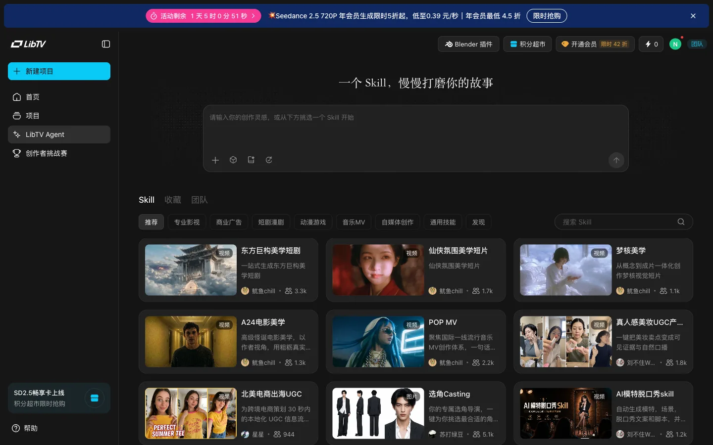
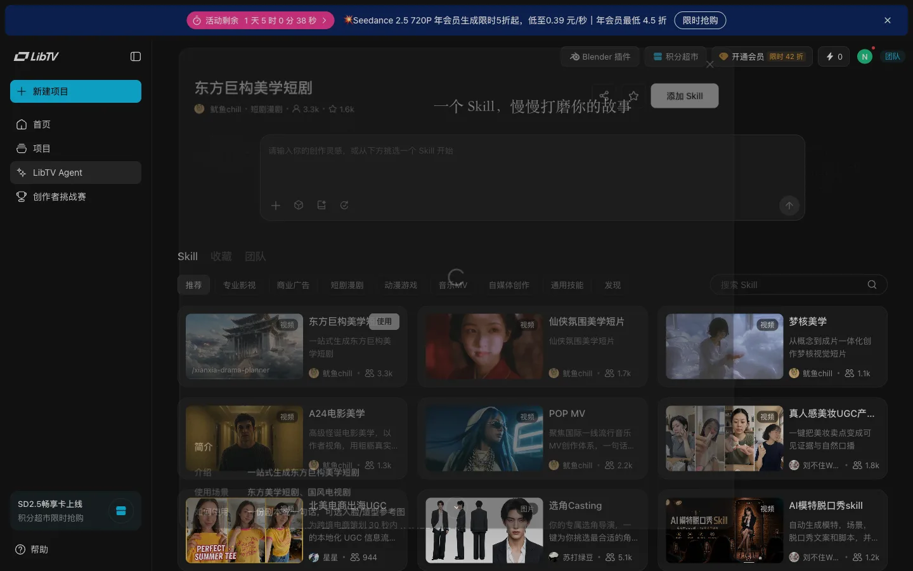

# libtv.tv-skill — summary

States: 2 · Transitions: 1 · Explored 2026-09-08 (owner session via opencli bridge; credits 0, no generation submitted).

## States

- `libtv.tv-skill.default` — tab Skill · overlay none · selected none — 
- `libtv.tv-skill.detail` — tab Skill · overlay skill-detail · selected skill:东方巨构美学短剧 — 

## Key observations

- **O** (libtv.tv-skill.default) Marketplace of agent skills with author and usage counters.
- **O** (libtv.tv-skill.detail) Skill contract is documented as inputs (一份剧本或一句话，可选人脸/造型参考图) and outputs (角色/道具/场景资产图、逐镜分镜表格、仙侠短剧视频成片).

## Transitions

- libtv.tv-skill.default —[click: skill card]→ libtv.tv-skill.detail · overlay.opened (O)
